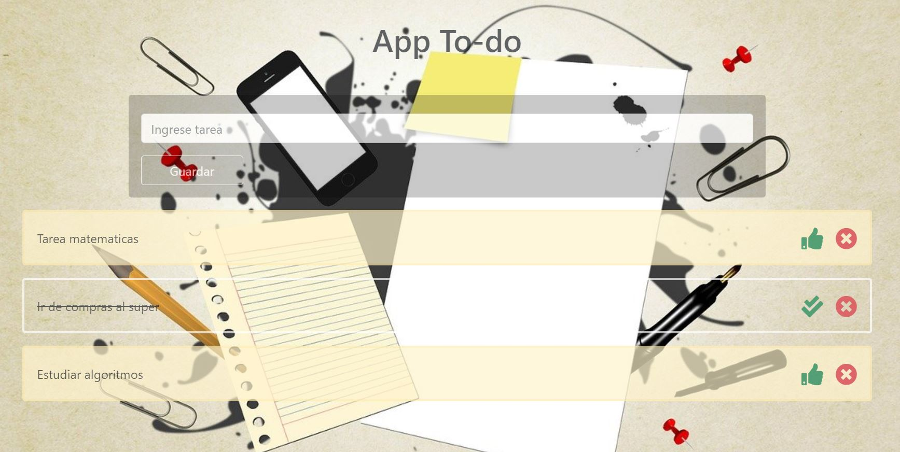

# To_Do-Html_Bootstrap_JavaScript
Esta aplicación utiliza Html, Bootstrap y JavaScript. Además como fuente de los iconos fontAwesome 
Donde repasamos conceptos de manipulación del DOM, además guardamos los datos en el localStorage del navegador.

